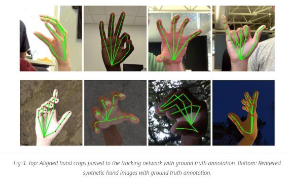
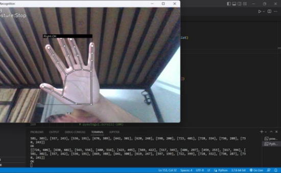
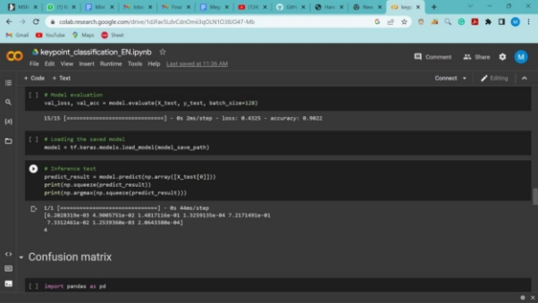
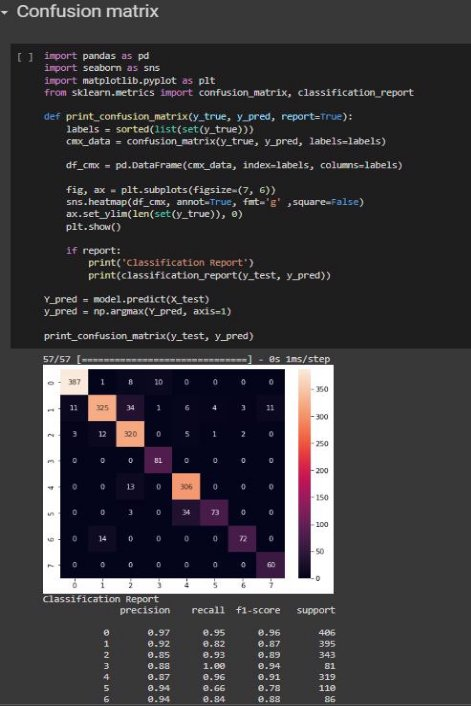
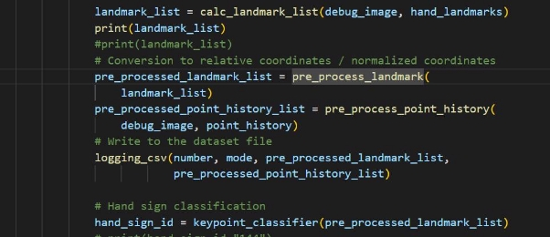
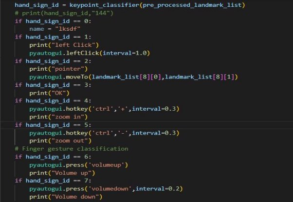

**Final Year BTech Project-I Report** 

On 

**Virtual Mouse Using Hand Gesture** 

*For the Degree of*       **Bachelor of Technology** 

*In* 

**Computer Science and Engineering** 

*Submitted by*                      **2019BTECS00013 Mohd Nifasat Beg  2019BTECS00023 Kartik Khunda** 

` `**2019BTECS00060 Suvansh Sharma  2019BTECS00098 Anchit Gupta** 

*Under the Guidance of* **Prof. A.S. Pawar** 

![ref1]

**Department of Computer Science and Engineering, Walchand College of Engineering, Sangli.** 

(*An Autonomous Institute*) 

**2022-23** 

![ref1]

**Walchand College of Engineering, Sangli.** 

(*An Autonomous Institute*) 

**Department of Computer Science and Engineering CERTIFICATE** 

This  is  to  certify  that  the  Project  Report  entitled,  **"VIRTUAL  MOUSE  USING  HAND GESTURE"** submitted by  

`  `**2019BTECS00013 Mohd Nifasat Beg** 

`                                        `**2019BTECS00023 Kartik Khunda** 

` `**2019BTECS00060 Suvansh Sharma                                          2019BTECS00098 Anchit Gupta** 

to Walchand College of Engineering, Sangli, India, is a record of bonafide Project work of course **"PROJECT-I”** carried out by him/her under my/our supervision and guidance and is worthy of consideration  for  the  award  of  the  degree  of  Bachelor  of  Technology  in  Computer  Science  & Engineering during the academic year ***2022-23***.  

**Prof. A.S. Pawar  Dr. B.F Momin  Mr. S.D. Pujari** 

Guide  Panel Member  Panel Member 

**Dr. Mrs.  M. A. Shah** 

Head 

Department of Computer Science and Engineering

**Acknowledgement** 

This Project would not have been possible without the kind support and help of many individuals and organizations. We would like to extend our sincere thanks to all of them. We are highly indebted to Prof. Ms. A. S. Pawar for guidance and constant supervision as well as for providing necessary information regarding the project and for their support in completing the project. We would also like to express our gratitude towards Director of Walchand College of Engineering, Sangli, HOD of the CSE  dept.  WCE,  Sangli  for  their  kind  cooperation  and  encouragement  which  provided  help  in completion of this project. 

**Declaration** 

I hereby declare that work presented in this project report titled **"VIRTUAL MOUSE USING HAND GESTURE"** submitted by us in the partial fulfillment of the requirement of the award of the degree of Bachelor of Technology (B.Tech) Submitted in the Department of Computer Science & Engineering, Walchand College of Engineering, Sangli, is an authentic record of my project work carried out under the guidance of Prof. A.S. Pawar, Computer Sci. & Engg. Dept, WCE, Sangli. 

`     `**2019BTECS00013   Mohd Nifasat Beg      2019BTECS00023  Kartik Khunda** 

`     `**2019BTECS00060  Suvansh Sharma      2019BTECS00098**  **Anchit Gupta** 

Date : 

Place : Sangli. 

***Abstract*** 

Technology today has changed our outlook the way we experience this real world. In couple of years’ technologies has changed how we do small and large number of things. Technology came out with new advance level where user can use gestures and virtually control interaction with the Computer. 

For example, during this pandemic we all have learned to get Digitalized and avoid contact with One another. 

Considering the current Scenario, we thought of creating an application that can benefit users for contactless interactions with the systems such as ATM, Flight Boarding etc. 

The concept is to use a simple camera instead of a classic or standard mouse to control mouse cursor functions. The Virtual Mouse provides an infrastructure between the user and the system using only a camera. It allows users to interface with machines without the use of mechanical or physical devices, and even control mouse functionalities. This study presents a method for controlling the cursor’s position without the need for any electronic equipment. While actions such as clicking and dragging things will be carried out using various hand gestures. As an input device, the suggested system will just require a webcam. The suggested system will require the use of OpenCV and Python as well as other tools. The camera’s output will be presented on the system’s screen so that the user can further calibrate it. 

1. **Problem Statement** 

To design a virtual mouse that detects hand gestures and performs mouse operations only using the fingers. Different combinations of fingers can be used to perform different operations of the mouse based on the particular combination of fingers. In the Proposed system, users don’t have to color their fingers with a specific color and are not required to use any device or sensors 

2. **Introduction** 

Hand gesture technology is applied in many different fields in today’s world of automation, including medical applications, industry applications, IT hubs, banking sectors, and so on. This idea is based on the common notion of using hand gestures to manage a laptop or computer. The Human Machine Interface (HMI) is a hardware and software system that aids in the communication and exchange of information between the humans and the machine. As part of HMI devices, we commonly employ numerous indicators such as LEDs, Switches, Touch Screens, and LCDs. Hand Gestures are another unique means of communicating with devices such as robots or computers. Have you ever wished to operate your PC or Laptop by simply waving your finger in the air? We address the challenges of using gestures to control computer applications that include both static symbols and dynamic motions. Each gesture  is  modeled  using  either  static  model  information  or  a  dynamic  system  that  is  linear  in parameters. Instead of using numerous devices such as keyboards, mice, joysticks, and so on, we may now simply utilize hand moments/hand gestures to control the laptop’s functionalities. We used hand gesture control in this project, which allows users to control music, video, browser, documents, games, navigation, and many other functions. Recognition takes place in real-time, with only a tiny amount of processing  time  and  memory  required.  We  investigate  which  motions  are  appropriate,  how  to recognize them, and in which order they should control.  Myriads of technological advancements are occurring in today’s society, such as natural language processing, biometric authentication, and face detection, which can be found on our tablets, iPads, computers, and smartphones. Similarly, Hand Movement  Identification  was  a  modern  form  of  Human–Machine  Interconnection,  in  which  the system’s mouse cursor could be controlled simply by placing our figure in front of the computer’s web camera. 

3. **Motivation** 

The motivation was to create a human interaction application to interact with the computer and develop a virtual human-computer interaction device. The existing system was costly and used some extra sensors or material on hand to make the virtual device. 

4. **Significance** 
1. It is cost-effective as no external mouse is required.  
1. It can be used in airports for virtual touch while generating boarding pass.  
1. It can be used in ATMs and avoid the bacterial transmission of touch as we have seen in           the Covid pandemic. 
5. **Literature Survey** 

|**Sr. No** |**Name of Research Paper** |**Author Name** |**Technology Used**  |**Advantages/Di sadvantages**  |
| - | :- | - | :- | :- |
|1\. |Virtual Mouse Control Using Colored Fingertips and Hand Gesture Recognition.  |Vantukal Reddy, Thumma Dhyanchand, Galla Vamsi Krishna, Satish Maheshwaram |Hand Gesture Recognition, Image Processing, Neural Network Algorithm, Python OpenCV, pyautogui |
**Advantage:** Used neural network for hand gesture recognition.  **Disadvantages**

**:** The limitation of this is that they used Colored Fingertips 
|
|2\.  |Virtual Mouse Implementation Using Opencv, 2019 |Kollipara Sai Varun, I Puneeth, Dr.T.Prem Jacob  |Opencv, IP, Deep learning, Pyautogui, numpy, Anac onda |
**Advantages**: used python for hand gesture recognition. **Disadvantages**

: In this they used color variation techniques, it’s very complex to use.  
|
|3\. |` `Hand Gesture - Virtual Mouse for Human Computer Interaction, 2018 |Sherin Mohammad, V H preetha |Matlab s/w, Two Cameras |**Advantages**: Gives 90% Correct Detection for |

|||||
both views, under enough Light Condition. **Disadvantages**

: Used two cameras and its cost is more. 
|
| :- | :- | :- | :- | :- |
|4 |Virtual Mouse, 2015 |` `Ashish Mhetar.B K Srioop, Kavya AGS Ramanath Nayak, Ravikumar Javali, Suma K V  |IR Camera, USB-HID, IR PEN, Teensy.  |
**Advantages**: It works as a virtual marker. It is effective to use while teaching. **Disadvantages**

: The Cost of the hardware devices used is more 
|
|5 |Virtual Mouse using Object Tracking, 2020 |Monali Shetty, Christina Daniel, Manthan Bhatkar, Ofrin Lopes |HSV Technique, Python, Opencv |
**Advantages**: Accuracy of this system in the plain background is 95%. **Disadvantages**

: Accuracy in Non-plain Background: 40% 
|
|6 |Design and Development of Hand Gesture-based Virtual Mouse 2019 |Kabid Shibly, Samarat Dey, Aminul islam, Shahriar Showrav |HCI Techonology |
**Advantages**: use of latest technology. **Disadvantages**

**:** In this system barrier is the lightning Condition. That’s why the system still can’t enough to replace the Mouse  
|

6. **Objectives** 

Following are the objectives of the proposed dissertation work:  

1. To study different research papers on hand gesture recognition and get an idea about the previous work related to the project.  
1. To study different algorithms that can be used for hand gesture recognition  
1. To  design  or  develop  a  system/model  that  can  be  used  to  recognize  the  different  classes  of combinations of hand gestures and control the mouse pointer using different hand gestures.  
1. To combine the mouse functionality with the different classes of the model developed. 
1. To analyze and evaluate the performance and accuracy of the system.  
7. **Methodology** 

In order to create a virtual mouse using hand gestures we need to have an algorithm/model using which we can recognize the hand gesture and based on different kind of hand gestures we can perform different kind of operations like increase volume, decrease volume, zoom in, zoom out, move mouse pointer, click. 

Following is the methodology proposed for the project: 

- The main problem that we are facing is detecting and separating the hand from the image. There are many problems like the background color, different sizes of hands, and other body parts like the face, arm etc. So instead of creating our own model to detect the hand we can use the already-built Google media pipe that is trained to detect and separate the hand from the background. 
- We will be using Google’s Mediapipe to detect and track the hand from the image frame and the Google’s media pipe returns the landmark of the hand. There are 21 landmarks of one hand that are returned. The landmark returned by the media pipe are shown below. 

  

- After the landmarks are obtained we are creating a model that takes landmarks of the hands at different positions and each of these landmarks at different positions is classified to represent a particular function of the mouse.  
- After the landmarks are obtained we need to normalize the points obtained. So that the distance of the hand from the screen is not a problem and it becomes easy for us to train the new model. 
- Then these landmarks are passed as input to the model and the model is trained to classify the different landmarks to different classes. 75% of the dataset is used to train the model and the remaining 25% is used to test the model. 
- After the model is able to classify the hand to different classes accurately. We can use the model to detect the hand class and after the class is detected we can write a python script to perform different functions of the mouse using the python library pyautogui. 

Functional Block Diagram: 

8. **Implementation and results** 

**Python library used:** 

**Mediapipe Model Loading** 

Landmarks returned by the mediapipe are show above. 

These landmarks are processed and then send to keypoint\_classifier.csv. This csv file is then used to train and test our model. 

**Data in keypoint\_classifier.csv** 

**Training and Testing of the model:** 

***ACCURACY :-*  90%** 

**Running the model with real-time images from the camera:** 

The obtained classification is shown in the image at real-time and is shown below: 

**We represent these classes with the numbers and are stored in Keypoint\_classifier\_csv.** 

**Based on the id of the class obtained we perform the mouse functionality using pyautogui module of python.** 

9. **Conclusion** 

This project illustrates how to use computer operations through hand gestures and movements, which is one of the most efficient methods to utilize a computer. It’s one of the most fundamental ways of human-computer communication. It’s a budget-friendly strategy. Using this strategy, we may quickly and simply accomplish practically any fundamental operation, as well as keyboard shortcuts. We may use this method to develop our own code to do whatever action we want. However, this system cannot recognize the movement of the hand as a gesture. Different combinations of hand gestures are used to perform different mouse operations.  

**References** 

1. Amornched Jinda-apiraksa, Warong Pongstiensak, and Toshiaki Kondo,[ "A Simple Shape-Based Approach to Hand Gesture Recognition", in Proceedings of IEEE International Conference on Electrical Engineering/ Electronics Computer Telecommunications and Information Technology (ECTI-CON), Pathumthani, Thailand, pages 851-855, May 2010](https://ieeexplore.ieee.org/document/5491589)
1. N. Yasukochi, A. Mitome and R. Ishii,[ "A Recognition Method of Restricted Hand Shapes in Still Image and Moving Image as a Man-Machine Interface", IEEE Conference on Human System Interactions, pp. 306-310, 2008.](https://ieeexplore.ieee.org/document/4581453)
1. H. Xu, X. Hou, R. Su and Q. Ni,[ "Real-time Hand Gesture Recognition System based on Associative Processors", The 2nd IEEE International Conference on Computer Science and Information Technology, pp. 14-18, August 2009.](https://ieeexplore.ieee.org/abstract/document/5234784)
1. Q. Zhang, F. Chen and X. Liu,[ "Hand Gesture Detection and Segmentation Based on Difference Background Image with Complex Background", 2008 International Conference on Embedded Software and Systems (ICESS2008), pp. 338-343, July 2008.](https://ieeexplore.ieee.org/document/4595579)
5. V.I.Pavlovic, R.sharma, and T.S.Huang,[ "Visual Interpretation of Hand Gestures for Human-Computer Interaction: A Review," IEEE Trans. On PAMI, vol 19,pp.677-695,1997](https://ieeexplore.ieee.org/document/598226)
***Final Year BTech(CSE) Project-I Report 2022-23***                                                                            Page 17** of 17**

[ref1]: ./sc/Aspose.Words.450fdbc3-d918-4b41-9aab-622e70608aa0.001.png
